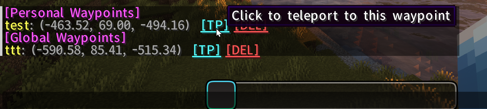
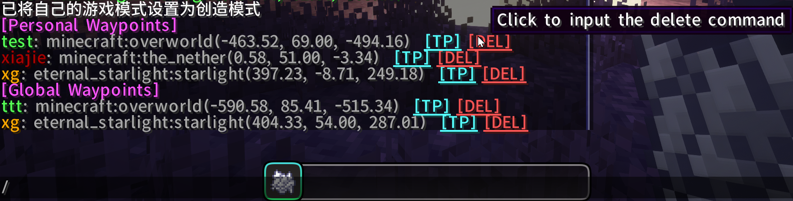

# SimpleTP
[English](README.md) | **简体中文**

一个简单的传送插件，旨在实现和扩展EssentialsX的传送功能。

## 预览

## 特点和命令
下文以默认前缀"!!stp"为例，实际使用时请根据配置文件中的前缀进行调整。

### 个人传送点
玩家可以创建和管理自己的传送点，仅对自己可见。
- **创建个人传送点**: `!!stp setp <name>`
- **传送到个人传送点**: `!!stp tpp <name>`
- **删除个人传送点**: `!!stp delp <name>`
- **列出所有个人传送点**(可点击操作传送点): `!!stp listp`

### 全局传送点（公共传送点）
全局传送点对所有玩家可见，适用于公共区域。
- **创建公共传送点**: `!!stp setg <name>`
- **传送到公共传送点**: `!!stp tpg <name>`
- **删除公共传送点**: `!!stp delg <name>`
- **列出所有公共传送点**(可点击操作传送点): `!!stp listg`

### 其它命令
- **列出所有传送点**(个人和公共): `!!stp list`
- **回到上一位置**: `!!stp back` ，使用传送命令传送后或死亡后可用

## 配置文件
配置文件位于`config/SimpleTP/config.json`
- **prefix**: 命令前缀，默认为`!!stp`
- **back_on_death**: 是否在玩家死亡后自动记录位置，默认为`true`
- **save_interval**: 定时保存传送点数据的间隔时间，单位为秒，默认为`30`秒
- **permissions**: 权限配置
- **worlds**: 支持的维度列表（支持Mod中的异维度世界），默认为`["minecraft:overworld", "minecraft:the_nether", "minecraft:the_end"]`，不在此列表中的维度将无法使用传送功能，如要禁用某个维度的传送功能，将其从列表中移除即可。

### 权限配置
- **back**: 使用`!!stp back`命令的权限
- **tpa**: 使用`!!stp tpa`命令的权限
- **tpahere**: 使用`!!stp tpahere`命令的
- **tp**: 使用`!!stp tp <player>`命令的权限
- **tphere**: 使用`!!stp tphere <player>`命令的
- **tp_xyz**: 使用`!!stp tp <x> <y> <z>`命令的权限
- **personal_waypoint**: 设置/删除 个人传送点相关命令的权限
- **global_waypoint**: 设置/删除 全局传送点相关命令的权限
- **cross_world_tp**: 跨维度传送的权限

## 依赖插件
- **minecraft_data_api**: 用于获取玩家信息
- **mg_events**: 用于监听玩家死亡事件

## 常见问题
- **点击传送按钮没有反应**
    MCDR对高版本MC的点击执行支持有问题，需要安装 [LetMeClickAndSendForServer](https://github.com/Fallen-Breath/LetMeClickAndSendForServer)(服务端) 或 [LetMeClickAndSend](https://github.com/Fallen-Breath/LetMeClickAndSend)(客户端)。
- **有时死亡后back指令无法回到上一个位置**
    一些Mod的死亡消息比较特殊，可能无法被mg_events监听到。需要手动在mg_events的语言文件中添加对应的死亡消息。例如 [永恒星光](https://www.curseforge.com/minecraft/mc-mods/eternal-starlight) Mod 中，玩家在以太中死亡需要在 `config/mg_events/lang/zh_cn.json` 中添加 `"death.attack.ether": "%1$s飘然而去",`, 在 `config/mg_events/lang/en_us.json` 中添加 `"death.attack.ether": "%1$s drifts away"`。
- **日志输出Player {player} is in a dimension not enabled in config: {dimension}**
    这表示玩家处于一个未在配置文件中启用的维度。请检查 `config/SimpleTP/config.json` 中的 `worlds` 配置，确保包含了此维度。

## TODO
按照优先级排序：
- [x] 支持传送点的点击操作
- [x] back 命令支持往返传送
- [x] 传送点记录玩家的维度（下界、主世界、末地）
- [x] 是否允许跨维度传送配置
- [x] 定时保存传送点数据（防崩溃丢失）
- [ ] tp/tphere 功能
- [ ] tpa/tpahere 功能
- [ ] 增加帮助信息
- [ ] 传送点记录玩家的朝向
- [ ] 添加传送点的描述信息
- [ ] 传送冷却配置
- [ ] 传送点的最大数量限制配置
- [ ] 传送点的名称长度限制配置
- [ ] 传送点安全检测，如传送点在危险位置则提示确认或传送到附近安全位置
- [ ] 传送代价配置 (消耗自定义的物品或经验)(基础消耗+距离消耗)
- [ ] 多语言支持
- [ ] 更多功能需求可以在 issues 中提出🚀
